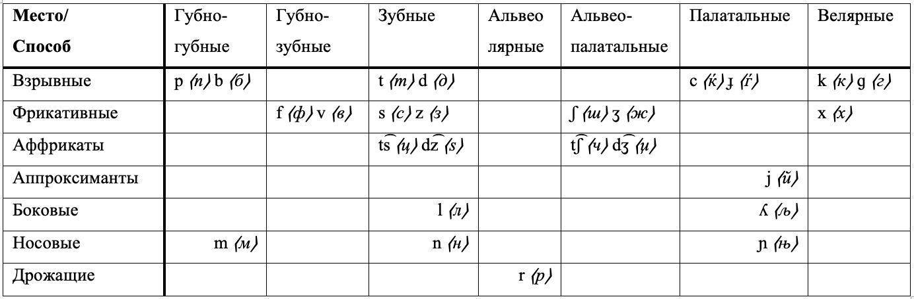
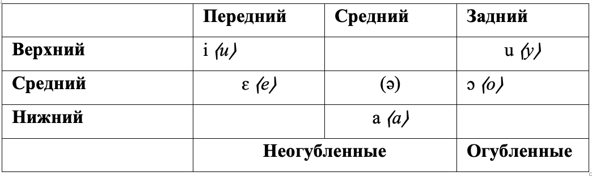
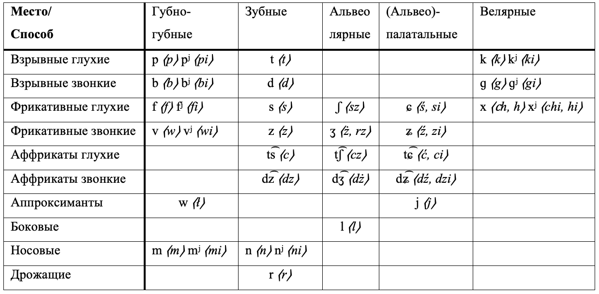
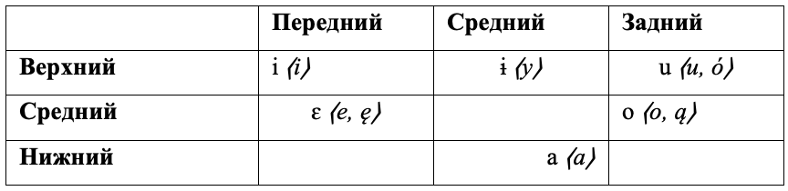
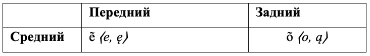
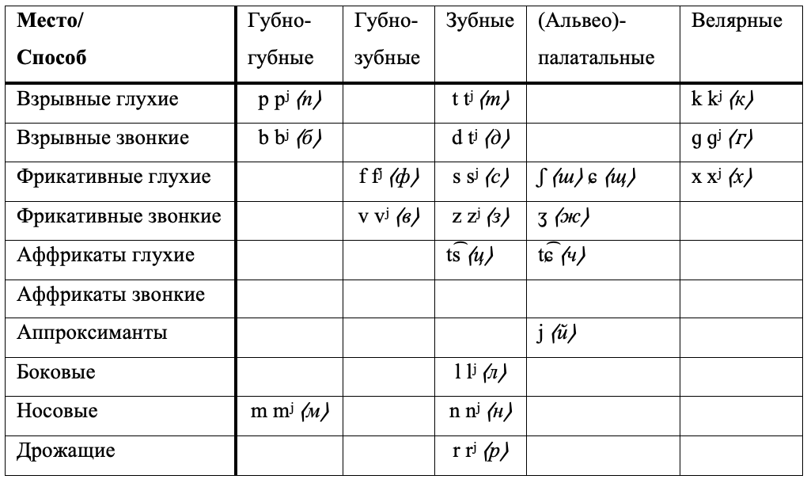
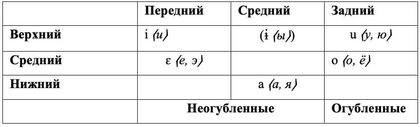
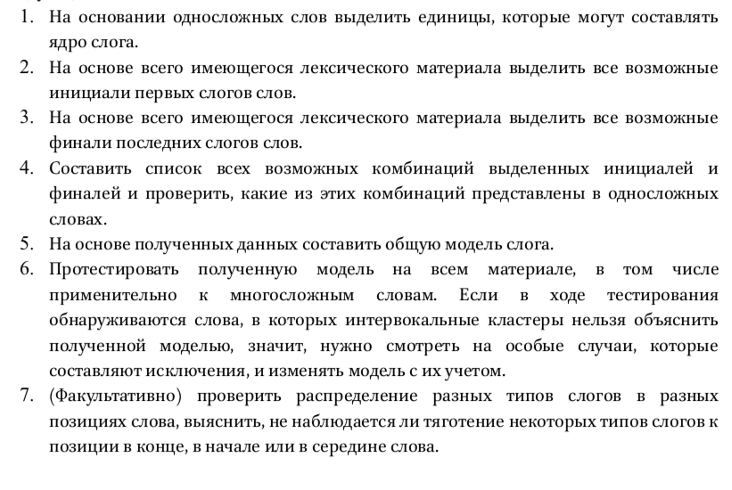

```{r setup, include=FALSE}
knitr::opts_chunk$set(echo = FALSE, message = FALSE)
library(tidyverse)
library(kableExtra)
```


## Введение/цель 

  * описание слоговой структуры македонского, польского, русского 
    - построение модели слоговой структуры для каждого языка 
  * (полу-)автоматизация 
  * использование большого массива данных для построения и проверки модели 

<!--- обычно говорят про слогоделение потому что это традиционно релевантно для языков на которых про это говорят но непосредственно структурой слога мало кто занимается -->

## Обзор языков   

Indo-European > Balto-Slavic > Slavic > 

  - South Slavic > Eastern South Slavic > Macedo-Bulgarian > Macedonian  
  - West Slavic > Lechitic > Polish  
  - East Slavic > Russian  

[@glottolog2019]

# Македонский язык

## Фонетическая система: согласные  



по [@friedman2002], [@usikova2003]

## Фонетическая система: гласные 



по [@friedman2002], [@usikova2003]

# Польский язык 

## Фонетическая система: согласные 



по [@feldstein2001]

## Фонетическая система: гласные 





по [@feldstein2001]

# Русский язык 

## Фонетическая система: согласные  



по [@andrews2001], [@timberlake1993], [@timberlake2004]

## Фонетическая система: гласные  



по [@andrews2001], [@timberlake1993], [@timberlake2004]

# Слог и слогова структура 

## Описание фонотактической структуры (1)

инициаль — ядро — финаль

* инициаль — согласные, предшествующие ядру  
* финаль — согласные, следующие за ядром 
* ядро — вершина слога 

<!--- ядро, центр — самый звучный элемент -->

## Описание фонотактической структуры (2): 

Теория сонорности [@clements1990] предсказывает распределение разных типов сегментов относительно ядра 

Иерархия сонорности [@wright2004]: 

бо́льшая звучность - - - - - - - - - - - - - - - - - - - меньшая звучность 

гласные > глайды > плавные > носовые > фрикативные > взрывные 

## Кластеры и слоги 

*простые* vs *сложные* [@maddieson2009] 

**C** — *cosonant* согласный, **V** — *vowel* гласный, в скобках — опциональных элементы 

  * простые: *(C)V(V)* 
    - например, гавайский язык (австронезийская семья) [@wals-12]
  * сложные: *(C)(C)(C)V(C)(C)*
    - например, адыгейский (абхазо-адыгская семья) [@moroz2019]

<!--- простые — только один согласный в инициали, все слоги строго открытые; сложные — все остальные -->

## Методы определения принципов слогоделения 

- элицитация [@duanmu2009]

- эксперименты [@cote2010]

- частичная автоматизация процесса [@czerniak2015], [@moroz2019]

<!--- элицитация — теряются данные; эээксперименты — Коте и Харламов: от эксперимента зависит результат, статья на материале РЯ; автоматизация процесса: на материале больших массивов, то есть редкие или неочевидные кластеры и/ли слоги не выпадут из рассмотрения +валидацие верификация ... -->

## Интервокальные кластеры: волновой характер слога 

Разные типы языков [@kodzasov1980]: 

* "квантовые" языки 
    - слог характеризуется пограничными сигналами, которые маркируют его границы 
* "волновые" языки
    - границы слога не маркируются 
    - ко-шка vs кош-ка [@knyazev1999]

<!--- волновые — границы слогов не маркированы, нет фон. маркеров на этих границах, квантовые — есть и это важно для, например, реализаций -->

<!--- языки скорее всего с волновым характером слога (как минимум в грамматиках не сказано иначе для языков кроме русского, потому что РЯ-таки пример языка) и поэтому интервокальные кластеры про них непонятно и мы их будет описывать при помощи абсолютных инициалей и финалей, точнее приложения их комбинаций на эти интервокальные кластеры  --> 

<!--- 
Ср.: в англ придыхательные — инициали 
Скалка от глагола скать —?????? не помню 
Скёшь — нас:-кёшь 
С различаются по длительности-интенсивности — показатель слоговой границы (более долгое произнесение щелевого), такое встречается и в других языках 
В английском языке глухие смычные согласные в начале ударного слога являются придыхательными, а в конце слога – глоттализованными7, поэтому если в слове atrocious ("отвратительный") произносится аспирированный [th], а в слове Atlantic ("Атлантический") – глоттализованный [t?], это означает, что в первом случае слоговая граница проходит перед согласным (a-trocious), а во втором – после него (At-lantic)
-->

# Методология 

## Алгоритм по [@moroz2019] 



# Сбор данных 

## Сбор данных: македонский язык 

<!--- Списки слов для каждого языка составелны на материалах словарей (бОльших из возможных и достоверных, все словари имеются в онлайн доступе в интернете) --> 

Для македонского языка было собрано и размечено 54 474 лексем из *Онлайн словаря македонского языка* (Дигитален речник на македонскиот јазик) (ДРМЈ) 

Из рассмотрения были исключены: сокращения, аббревиатуры, сложные слова, междометия 

<!--- г. — Mr, г-ца — Miss; ДНК; жеже-пече — cricket сверчок, ин виво — в ествественных условиях, ин витро — в пробирке; е — hey vs е — be  -->

В итоговой выборке 53 468 лексем 

## Сбор данных: польский язык 

Для польского языка обкачен *Грамматический словарь польского языка* (Słownik Gramatyczny Języka Polskiego) (SGJP) 

Всего: 7 967 216 словоформ 

Исключены: "бессложные слова" — *NKWD*, *TKKF*, *KGB* 

В итоговой выборке: 7 967 118 словоформ 

<!--- Towarzystwo Krzewienia Kultury Fizycznej ~ объединение пропагандистов физической культуры --> 

<!--- нет специальных тегов в словаре/сложно доставать, поэтому эти слова просто уделены, потому что они, как правило, сокращения/аббревиатуры --> 

## Сбор данных: русский язык 

Для русского языка данные собраные из подготовленного *Открытого грамматического словаря русского языка*: 

- 102 375 лексем 
- 4 596 304 словоформ 

<!--- есть специальная разметка начальных форм и неначальных, их легко отделить, в отличии от польского --> 

# Описание данных  

## Методология (1)

1. На основании грамматических описаний: 
- для македонского [@friedman2002], [@usikova2003], 
- для польского [@feldstein2001],  
- для русского [@andrews2001], [@timberlake1993], [@timberlake2004]

и односложных слов выделены единицы, которые могут составлять ядро слога: 

  * гласные 

для македонского языка: 
  
  * слоговые: 
    - /r̩/ в начале слова перед согласным: *рж* [r̩ʒ]; 
    - /r̩/ в позиции между двумя согласными: *крв* [kr̩v]; 
    - /r̩/, /l̩/, /n̩/ в конце слова после согласного и в заимствованиях: *тембр* [tɛmbr̩], *сингл* [sinɡl̩], *њутн* [ɲutn̩] 

<!--- *шатл*, *ансамбл*, *артикл*, *бинокл* -->

<!--- но сонорные не всегда слоговые!!! -->

<!--- по грамматикам в польском нет слоговых, они возникают только в быстрой речи; то же про русский язык --> 

## Методология (1.5) 

Упрощение:

- **V** — *vocalic* <!--- именно вокалические элементы, то есть вокалическая вставка у слоговога будет обознычена так: R > ə-R > V-S --> 
    * вершина слога 
- **S** — *sonorant* сонорные 
    - аппроксиманты **J** 
    - вибранты **R** 
    - боковые **L** 
    - носовые **N** 
- **O** — *obstruent* шумные  
    * фрикативные, аффрикаты, взрывные 

<!--- в одной из репрезентаций сонорные разделены потому что они различны в сонорности, но шумные не разделены потому что что бы не делали они не перейдут границуу сонорности -->

<!--- аппроксиманты: semi-vowels, glides, non-syllabic voiced: j, w; 

liquid consonants,  плавные: r + l -->
<!--- да, все они. да, трилли "иногда" к ним относятся но, согласно грамматикам здесь только они -->
<!--- боковые: l -->

<!--- носовые: m n -->

## Методология (2&3)

2&3. На основании собранного лексического материала выделить возможные абсолютные инициали и финали 

<!--- так как в македонском сравнительно других выборок меньше слов то сразу включены не только односложные — для других были и для односложных -->

<!--- абсолютные инициали и финали: инициали первых слогов и финали последних слогов --> 

## Методология (4)

4. Составить список возможных инициалей и финалей, составить список комбинаций: 

[кластер конечный] + [кластер начальный] 

например, **OS** *V* **SS** > **SS OS** 

## Методология (5)

5. На основании полученных данных составить общую (первичную) модель слога 

## Методология (6) 

6. Проверить первичную модель на выборке всех слов, (включая многосложные). 

<!--- !!!!! здесь стоит вставить примеры и остальное на другие слайды попереносить-->

Если модель определит слова, с интервокальными кластерами, которые не будут предсказаны этой моделью, 

нужно пересмотреть эти случаи и, при необходимости, скорректировать модель с учётом них 

<!--- потому что это попросту могут быть исключения или могут быть объяснены -->

## Литература 
